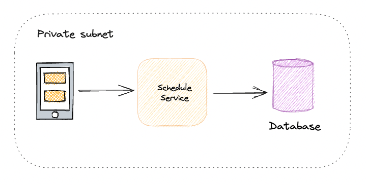
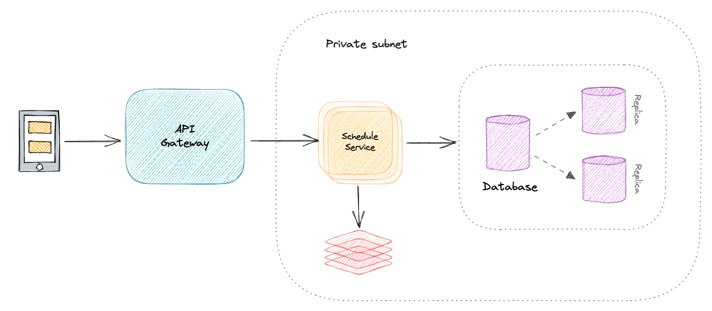

### Introduction
The api exposes a scheduling service that streamline and optimize meeting times for all team members.

### Functional Requirements
1. Input data should be valid
2. Incoming availabilities and computed result should be stored
3. Errors should get properly handled
4. Only authorized users can interact with the API

### Non-Functional Requirements
1. Service must expose a restful api
2. Data must be stored in a relational database
3. Service should follow SOLID principles
4. Service should scale

### Architecture


The application follows onion architecture, all processes flow from outside to inside: presenter to application,
and application to domain. The application was split in 4 different layers:
1. **Presentation**: Handles data input and output, in this case only http inputs
2. **Application**: Handles process logics, orchestrates the process through the domain, compute optimal
   meeting slot then store availabilities and optimal slot.
3. **Domain**: Handles business logic by controlling how entities state should change and how these entities
   are stored through interfaces
4. **Infrastructure**: Implements domain interfaces and offers connection to external applications or services.

### System Design
A reasonable initial design for this application would be simply having a single instance of the service in a private
network, being reachable by different services in the same network, it does not require horizontal scaling nor any high load
database strategy:


Once the application starts having a higher load, then different components can get introduced:
- First is an api-gateway that will put an interface between clients and the service, this will make easier to scale and apply different
reading/writing strategy over time;
- Assuming the service will have to deal with higher level of writing operations, a possible setup would be
database sharding
- Additionally, there is a caching component that could store previous computed agendas, would help avoiding
computation for participants that have a fixed weekly agenda and retrieving already computed results without
having to compute the information or reach the database



### Decisions made:
1. A MySQL database was used to store the input and computed result, for the sake of simplicity no additional
   tooling (ORM) was used to store these entries since there was no major need for it
2. Convert ranges into starting hour date: this was an initial decision so dates could get properly validated.
   The dates were fixed to a given week, however would be better to make sure that ranges are transformed into dates in the
   current week, what would require a few additional validations:
   1. Dates should either be provided in the very beginning of the week, or
   2. Ranges prior to the current date should be either not considered or request should fail
3. [Micronaut](https://micronaut.io/) was chosen as a framework, even though there was no major reason behind this choice.
   Micronaut was very easy to configure and run an application from scratch, a rest api is exposed out of the box
   and there is a very first endpoint and test set, which help moving forward. Extending its configuration is also very,
   and its documentation is well written and up to date, additionally, there were examples for all functionalities
   needed to complete the scheduler service.
4. Api-Key Authentication: This sort of service is usually run from a private subnet, there could be a more complex
   authentication implementation as well as audit logs, however it deals with provided data only and does not expose
   stored data, which means there is not a major need for access control. In this sort of situation an api-key
   becomes a reliable decision, it could have a rotation strategy and all clients updating the key
   in an automated way, for instance using terraform.

### Further Improvements
1. Standardize error handling: Micronaut has a pattern for error messages, even though it has a good contract,
   it exposes some internal information that could be used to exploit the application, would be better to have
   more generic error messages and have errors logged somewhere else. 
2. Showing computation histories: There was no requirement to load old computations, however once results are stored
   then the service could offer a way to retrieve computed information.
3. Better shape the api contracts: Ideally the api should receive a list of objects containing an attribute
   `name` and `availabilities` for each participant, as well as return camelCase properties instead of sentences:
   1. The input could look like:
        ```json
        [
            {"name": "Adrian", "availabilities": ["Monday 14:00-16:00", "Tuesday 09:00-11:00"]},
            {"name": "Johanna", "availabilities": ["Monday 15:00-17:00", "Wednesday 10:00-12:00"]},
            {"name": "Sebastian", "availabilities": ["Tuesday 09:00-11:00", "Wednesday 11:00-13:00"]}
        ]
        ```
   2. The output could look like:
        ```json
        {
            "optimalSlot": "Tuesday 09:00-11:00",
            "participants": ["Adrian", "Sebastian"]
        }
        ```
4. Proper api versioning: given the previous suggestion, the very same command handler could be used, however the input
   could be different, so a proper versioning would help to introduce a new way of input without breaking changes
5. Implement some migration tooling

## Running the application
I'm afraid there is no migration management, so you will have to run a few commands before start trying the app:
```shell
# to start
make up # will build the application and start docker environment, also logs will be show detached
make migration # will create required tables when needed
make logs # ctrl+x will close the logging follower, this command will show docker logs again 

# to stop
make down # stop the application
```
PS: If the migration fails to run, it will be required to copy the content of
[create_scheduler_api_tables.sql](.migrations/create_scheduler_api_tables.sql) and run in the database container

Once the app is up and running, you will be able to run requests:
```shell
curl --location 'http://localhost:8080/meetings/slots/optimal' \
--header 'X-API-KEY: compose-softgarden-scheduler-api-key' \
--header 'Content-Type: application/json' \
--data '{
    "Adrian": ["Monday 14:00-16:00", "Tuesday 09:00-11:00"],
    "Johanna": ["Monday 15:00-17:00", "Tuesday 10:00-11:00", "Wednesday 10:00-12:00"],
    "Sebastian": ["Tuesday 09:00-11:00", "Wednesday 11:00-13:00"]
}'
```

PS: Sometimes the application tries to connect to the database while it is not fully functional yet,
if it happens, the application container will die and restart again util the database is up and running
(sorry for that, need to check why)

### Running tests
Tests might be run by the makefile or the gradle wrapper, however make command will also check linting.
```shell
make test
./gradlew test
```
PS: There is unit and integration tests, no additional configuration is required to run them all

## Micronaut 4.1.2 Documentation

- [User Guide](https://docs.micronaut.io/4.1.2/guide/index.html)
- [API Reference](https://docs.micronaut.io/4.1.2/api/index.html)
- [Configuration Reference](https://docs.micronaut.io/4.1.2/guide/configurationreference.html)
- [Micronaut Guides](https://guides.micronaut.io/index.html)
---

- [Micronaut Gradle Plugin documentation](https://micronaut-projects.github.io/micronaut-gradle-plugin/latest/)
- [GraalVM Gradle Plugin documentation](https://graalvm.github.io/native-build-tools/latest/gradle-plugin.html)
- [Shadow Gradle Plugin](https://plugins.gradle.org/plugin/com.github.johnrengelman.shadow)
## Feature serialization-jackson documentation

- [Micronaut Serialization Jackson Core documentation](https://micronaut-projects.github.io/micronaut-serialization/latest/guide/)

## Feature micronaut-aot documentation

- [Micronaut AOT documentation](https://micronaut-projects.github.io/micronaut-aot/latest/guide/)
